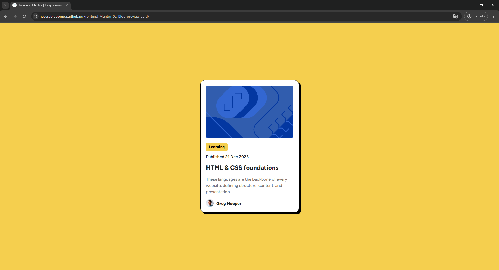
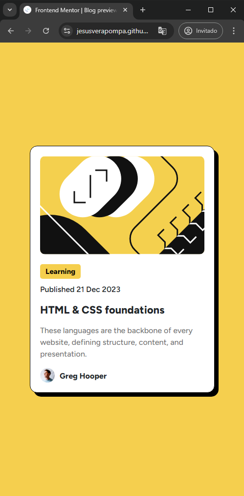

# Frontend Mentor - Blog preview card solution

This is a solution to the [Blog preview card challenge on Frontend Mentor](https://www.frontendmentor.io/challenges/blog-preview-card-ckPaj01IcS). Frontend Mentor challenges help you improve your coding skills by building realistic projects.

## Table of contents

-   [Overview](#overview)
    -   [The challenge](#the-challenge)
    -   [Screenshot](#screenshot)
    -   [Links](#links)
-   [My process](#my-process)
    -   [Built with](#built-with)
    -   [What I learned](#what-i-learned)
    -   [Continued development](#continued-development)
    -   [Useful resources](#useful-resources)
-   [Author](#author)
-   [Acknowledgments](#acknowledgments)

**Note: Delete this note and update the table of contents based on what sections you keep.**

## Overview

### The challenge

Users should be able to:

-   See hover and focus states for all interactive elements on the page

### Screenshot

### Links

-   Solution URL: [Add solution URL here](https://github.com/JesusVeraPompa/Frontend-Mentor-02-Blog-preview-card)
-   Live Site URL: [Add live site URL here](https://jesusverapompa.github.io/Frontend-Mentor-02-Blog-preview-card/)

## My process

### Built with

-   Semantic HTML5 markup
-   CSS custom properties
-   Flexbox
-   CSS Grid

### What I learned

I learned to use font types within html

### Continued development

### Useful resources

## Author

-   Website - [Add your name here](https://techpompahelp.com/)
-   Frontend Mentor - [@yourusername](https://www.frontendmentor.io/profile/JesusVeraPompa)
-   Linkedin - [@yourusername](https://www.linkedin.com/in/jes%C3%BAs-alberto-vera-pompa-26ba43190/)

## Acknowledgments
